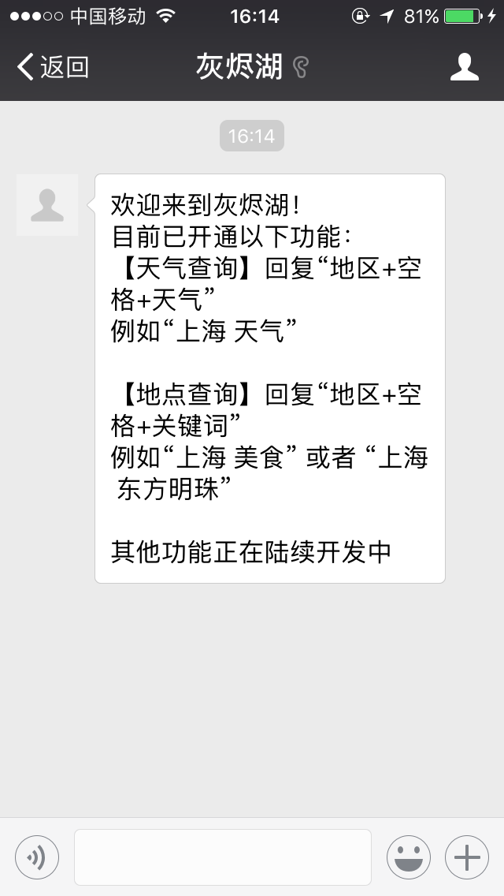
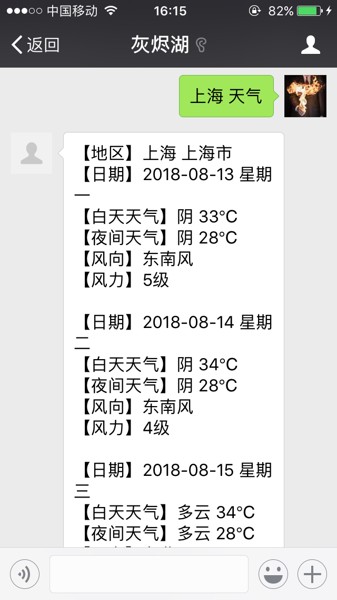
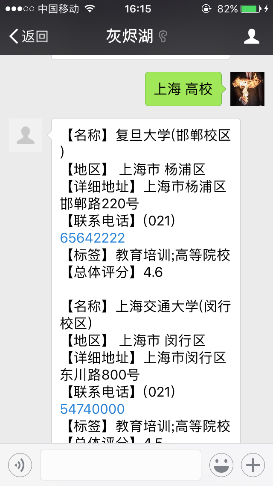

# WeChatOfficialAccount
个人微信公众号，目前实现天气查询和地理位置搜索功能

## 功能介绍
* 天气查询功能，回复“地区+空格+天气”，获取指定地区天气预报信息，如“上海 天气”；若有多个地区均予以显示
* poi地理信息搜索，回复“地区+空格+关键词”，查询相关地理信息，如“上海 美食”，“上海 高校”；考虑到篇幅最多只显示前五条信息，如果查询到的信息过多会予以提示

## 运用知识
* 查询功能通过调用相关api实现
* 使用gson处理json数据
* 使用maven进行项目管理

## 效果如下：

